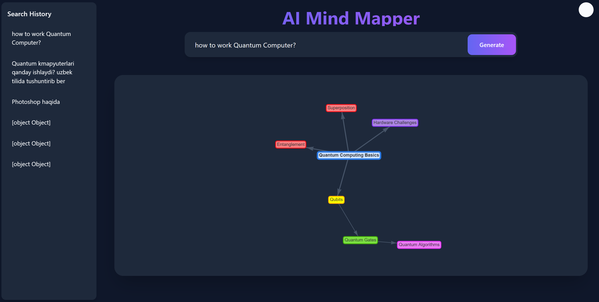
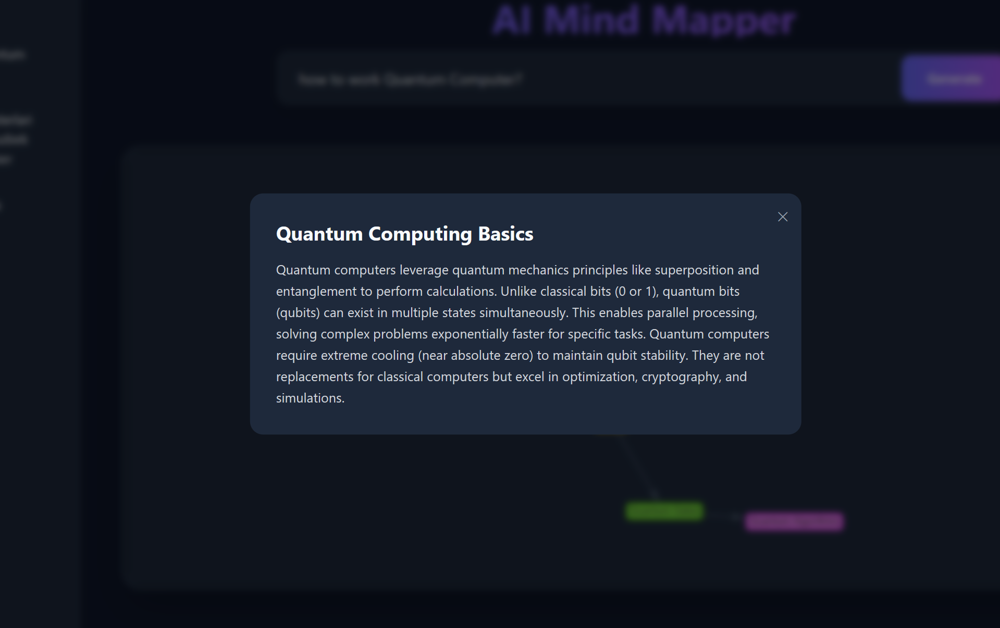
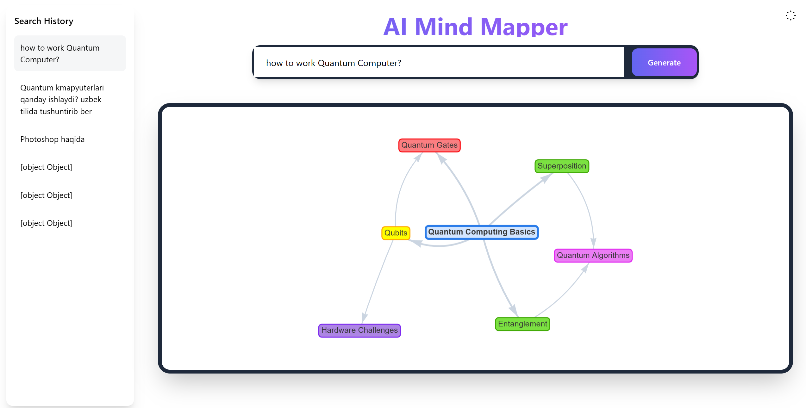
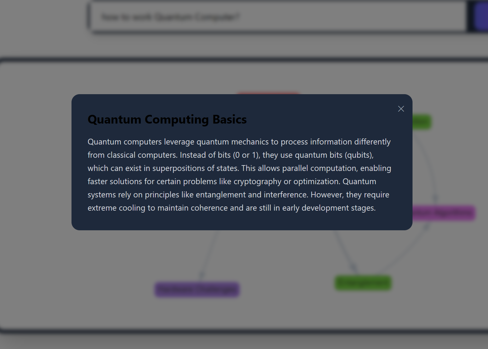

# AI Mind Map Generator 🧠🌐

[](https://www.python.org/)
[](https://www.djangoproject.com/)
[](https://developer.mozilla.org/en-US/docs/Web/HTTP/CSP)
[](https://opensource.org/licenses/MIT)


**Transform complex questions into secure, interactive mind maps using AI-powered insights**  
*Now with enterprise-grade security and enhanced visualization capabilities*

| Interface                                                       | Detailing                                                       | 
|-----------------------------------------------------------------|-----------------------------------------------------------------|
|        |        |
|  |  |


## Key Features 🔑

- **Military-Grade Security** 🔒
  - CSP Headers Protection
  - CSRF & XSS Safeguards
  - Rate-Limited API Endpoints
  - SQL Injection Protection

- **AI-Powered Intelligence** 🤖
  - Deepseek LLM Integration
  - Context-Aware Node Generation
  - Dynamic Knowledge Structuring

- **Professional Visualization** 📊
  - Hierarchical Network Layouts
  - Interactive Node Explanations
  - Real-time Canvas Manipulation
  - Multi-Device Responsiveness

- **Enterprise Readiness** 🚀
  - PostgreSQL Support
  - Environment-Based Config
  - CI/CD Ready Structure
  - Comprehensive Error Handling

## Tech Stack 🛠️

**Secure Backend**  
- Django 5.0 + django-csp
- PostgreSQL (Production)
- Redis Rate Limiting
- Deepseek API Integration

**Protected Frontend**  
- Vis.js (With SRI Hashes)
- Sanitized DOM Manipulation
- Tailwind CSS (PurgeCSS Optimized)
- Content Security Policy Headers

## Project Roadmap

### Phase 1: MVP Enhancement (Q3 2025)
- [ ] **User Authentication System**
  - Email/password registration
  - Social login (Google/GitHub)
  - Password reset functionality
- [ ] **Demo Version Limitations**
  - 1 free generation per day (IP-based)
  - Anonymous user tracking
  - Usage counter with timer
- [ ] **Basic User Dashboard**
  - Generation history
  - Account settings

### Phase 2: Monetization (Q4 2025)
- [ ] **Subscription Plans**
  |Tier | Price | Features
  |---|---|---|
  | Free | $0/mo | 1 daily generation, basic nodes |
  | Pro | $9/mo | Unlimited generations, premium templates |
  | Team | $29/mo | Collaborative editing, priority support |
- [ ] **Payment Integration**
  - Click/PayMe integration
  - Recurring payments
  - Invoice management
- [ ] **Premium Features**
  - PDF/PNG export
  - Custom color themes
  - Advanced AI models

### Phase 3: Collaboration (Q1 2026)
- [ ] **Team Workspaces**
  - Real-time co-editing
  - Comments & annotations
  - Version history
- [ ] **Sharing System**
  - Public/private mind maps
  - Shareable links
  - Embeddable maps

### Phase 4: Advanced Features (Q2 2026)
- [ ] **AI Assistant**
  - Contextual suggestions
  - Auto-layout improvements
  - Content validation
- [ ] **Template Marketplace**
  - User-generated templates
  - Premium template purchases
  - Rating system
- [ ] **API Access**
  - REST API for developers
  - Webhooks support
  - Rate-limited free tier


## Getting Started 🚦

### Prerequisites

- Python 3.10+
- PostgreSQL 14+ (Production)
- Deepseek API Key

### Installation

```bash
# Clone repository
git clone https://github.com/BotirBakhtiyarov/MindMap.git
cd MindMap

# Create virtual environment
python -m venv .venv
source .venv/bin/activate  # Linux/MacOS
.venv\Scripts\activate     # Windows

# Install dependencies
pip install -r requirements.txt
```

### Configuration

1. Create `.env` file:
```ini
# Required
DEBUG=False
DEEPSEEK_API_KEY=your_deepseek_key
SECRET_KEY=your_django_secret

# Production Database
DB_NAME=mindmap
DB_USER=db_user
DB_PASSWORD=secure_password
DB_HOST=localhost
DB_PORT=5432

# Security
SECURE_PROXY_SSL_HEADER=('HTTP_X_FORWARDED_PROTO', 'https')
ALLOWED_HOSTS=.yourdomain.com,localhost
CSRF_COOKIE_SECURE=True
```

2. Initialize database:
```bash
python manage.py migrate
python manage.py createsuperuser
```

### Development
```bash
# Run secure dev server
python manage.py runserver --insecure  # For static files
```

## Production Deployment 🚢

1. Configure reverse proxy (Nginx/Apache)
2. Enable HTTPS with Let's Encrypt
3. Set up PostgreSQL database
4. Configure environment variables:
```bash
export DEBUG=False
export SECRET_KEY=production_key
export CSP_REPORT_URI=https://yourdomain.com/csp-reports
```

5. Run with ASGI server:
```bash
gunicorn --workers 4 --timeout 120 MindMap.asgi:application
```

## Security Highlights 🔐

- **Input Sanitization** - All user inputs are HTML-escaped
- **CSP Headers** - Restrict unauthorized resource loading
- **SRI Hashes** - External script integrity verification
- **Security Headers** - HSTS, XSS Protection, Clickjacking guards

## Contributing 🤝

We welcome secure contributions! Please:

1. Create security-focused feature branches
2. Validate all user inputs in PRs
3. Include relevant test cases
4. Document security implications
5. Submit via signed commits

## License 📜

MIT Licensed - See [LICENSE](LICENSE) for details


